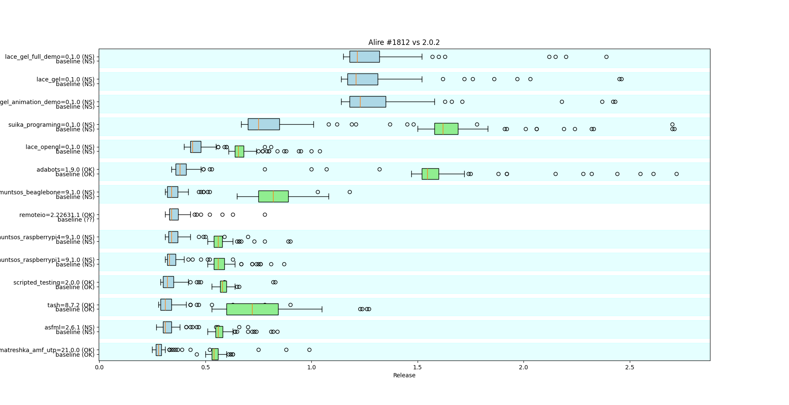
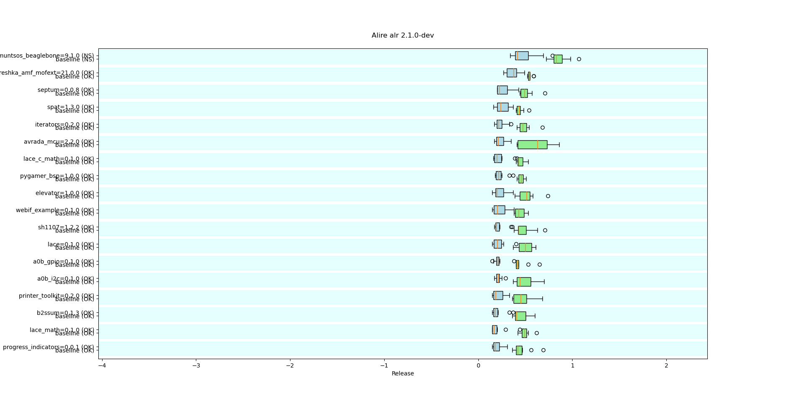
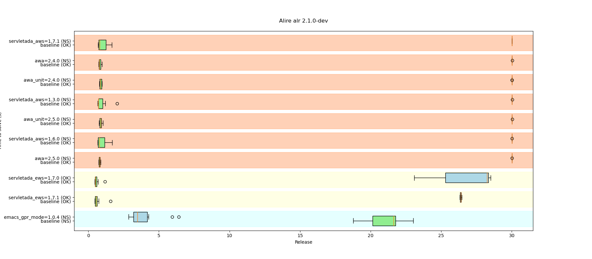

This repo contains specific tests about the Alire solver performance.

These tests are run on demand and locally only for now, to ascertain that
changes to the solver do not degrade its performance or introduce regressions.

Since solver timings will depend on the hardware, results are filed by
hostname.

## Changelog

### PR [1812](https://github.com/alire-project/alire/pull/1812): improvements for partial solutions

When no complete solution exists, a too pessimistic solution could be returned
at times. This PR fixes this issue, and the regressions introduced by #1739.

Current changes vs 2.0.2 with the new solver (excerpt):

In essence, solving is faster in general, and non-solvable cases are solved
much faster and with a better solution (the three top releases time out with
`alr 2.0.2`).

### PR [1739](https://github.com/alire-project/alire/pull/1739): non-recursive solver

This PR revamped the old recursive solver into a new one based on a priority
queue. However, some changes in behavior were identified thanks to this test suite.

Current improvements with the new solver:

Current regressions with the new solver:

