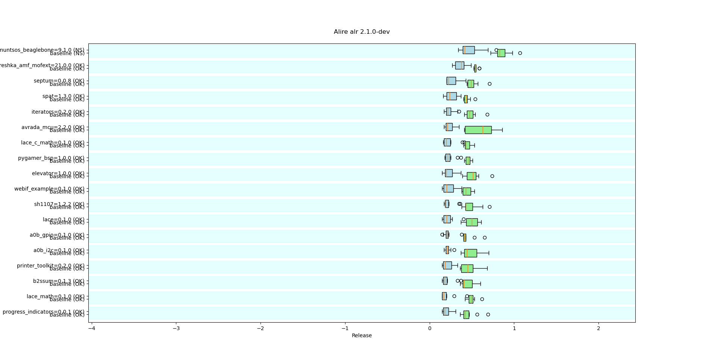

This repo contains specific tests about the Alire solver performance.

These tests are run on demand and locally only for now, to ascertain that
changes to the solver do not degrade its performance or introduce regressions.

Since solver timings will depend on the hardware, results are filed by
hostname.

Current improvements with the new solver:

Current regressions with the new solver:

